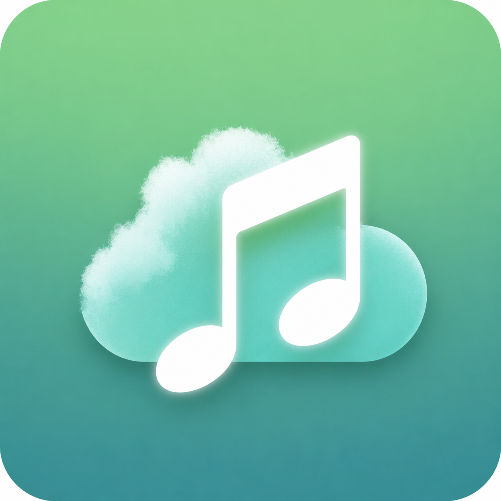

# NeteaseCloudMusicForMe

一款基于 **Kotlin + Jetpack Compose** 的第三方网易云音乐 Android 客户端，配有 Node.js 代理服务，支持 UnblockNeteaseMusic 音源替代。

## 截图

| | | |
|---|---|---|
|  |  | |

> 更多设计稿见 [design/](design/) 目录。

## 功能特性

### Android 客户端 (`app/`)
- **发现页** — 个性化推荐、歌单、排行榜
- **搜索** — 歌曲、歌单搜索
- **播放器** — 完整播放控制（播放/暂停/上一首/下一首/进度拖拽）
- **播放模式** — 顺序播放、单曲循环、随机播放
- **歌单管理** — 查看歌单详情、收藏/取消收藏
- **登录** — 二维码扫码登录
- **个人 FM** — 私人电台
- **歌词展示** — 逐行/逐字歌词同步
- **下载管理** — 歌曲缓存下载

### Node.js 后端 (`server.js`)
- 基于 [NeteaseCloudMusicApi](https://github.com/Binaryify/NeteaseCloudMusicApi) v4，提供完整 API 代理
- 支持登录态持久化（Cookie 文件存储）
- 自动音源替换 — 为灰化/受限歌曲从其他平台寻找替代播放源

### 音源替换 (`unblock.js`)
参考 [UnblockNeteaseMusic](https://github.com/nondanee/UnblockNeteaseMusic) 实现：
| 提供商 | 状态 |
|--------|------|
| **酷狗 (kugou)** | ✅ 完全正常 |
| QQ 音乐 | ⚠️ 搜索可用，播放接口已封锁 |
| 咪咕 (migu) | ❌ 已失效 |
| 酷我 (kuwo) | ❌ 已封锁 |

## 技术栈

### Android
- **语言**: Kotlin
- **UI**: Jetpack Compose + Material 3
- **架构**: ViewModel + Repository 模式
- **网络**: Retrofit / OkHttp
- **构建**: Gradle 8.2 + AGP 8.2.2 + Kotlin 2.0

### 后端
- **运行时**: Node.js
- **核心依赖**: NeteaseCloudMusicApi ^4.0.25
- **端口**: 3000（默认）

## 快速开始

### 1. 启动后端服务

```bash
# 安装依赖
npm install

# 启动 API 代理服务
npm start
# 默认监听 http://0.0.0.0:3000
```

### 2. 构建 Android 客户端

用 Android Studio 打开项目根目录，同步 Gradle 后直接运行 `app` 模块。

或命令行：
```bash
./gradlew assembleDebug
```

APK 输出位置：`app/build/outputs/apk/debug/`

## 项目结构

```
├── app/                          # Android 客户端
│   ├── src/main/
│   │   ├── java/com/ncm/app/
│   │   │   ├── data/
│   │   │   │   ├── api/          # 网络接口定义
│   │   │   │   ├── model/        # 数据模型
│   │   │   │   └── repository/   # 数据仓库
│   │   │   ├── playback/         # 音乐播放服务
│   │   │   ├── ui/
│   │   │   │   ├── navigation/   # 导航图
│   │   │   │   ├── screens/      # 各页面
│   │   │   │   │   ├── discover/ # 发现页
│   │   │   │   │   ├── login/    # 登录
│   │   │   │   │   ├── my/       # 我的
│   │   │   │   │   ├── player/   # 播放器
│   │   │   │   │   ├── playlist/ # 歌单详情
│   │   │   │   │   ├── quick/    # 快捷列表
│   │   │   │   │   └── search/   # 搜索
│   │   │   │   └── theme/        # 主题
│   │   │   └── viewmodel/        # ViewModel
│   │   └── res/                  # 资源文件
│   └── build.gradle.kts
├── server.js                     # API 代理服务
├── unblock.js                    # 音源替换模块
├── design/                       # 设计稿 & 素材
├── package.json
├── build.gradle.kts              # 根构建配置
└── settings.gradle.kts
```

## 配置

### 后端端口
```bash
# 可通过环境变量修改
export PORT=4000
npm start
```

### Android 端 API 地址
在 `NeteaseApi.kt` 中修改 `BASE_URL` 为你的后端地址。

## 许可

MIT
